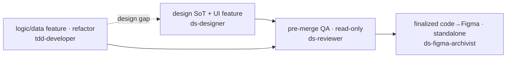
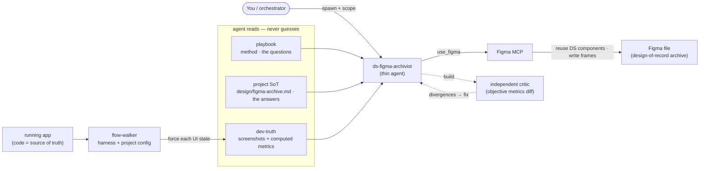

# ds-agents — Design System Agents for Claude Code

> Claude Code agents for solo founders / small teams. They set a clear division of labour between **brand** and **design**, so AI follows your brand rules whenever it writes UI — and once a screen is finalized, archives the result back into Figma.
>
> 中文版 → [README.md](./README.md)

---

## You might have hit this problem

Every time you spin up a new side project, somewhere mid-build you wonder:

- "Where do my brand rules actually live? scattered in Notion? in the repo? or only in Figma comments?"
- "This component the AI wrote — are the colors and spacing from my brand, or did it just make them up?"
- "The spec changed last week and the code didn't follow — which one is authoritative now?"
- "Every new project I re-scaffold the same folders. Tedious."

These aren't the AI being weak — it just **doesn't know where your brand rules live or which one to obey**. ds-agents pins that down: a fixed folder layout + a clear division of labour between agents, so AI **follows your brand** whenever it writes code.

This repo captures one real run: a fixed folder structure + a clear division of labour between agents + universal design knowledge (`references/`). **Not design-system theory** — a grounded SOP that survived one real shipment. From the second project onwards it's copy-and-adapt.

---

## What you get after installing

- **AI writes UI aligned to your brand** — ds-designer reads your `design/guideline.md` before touching a component; no more made-up color values, spacing, radii
- **Out-of-sync gets caught** — when spec and code diverge, ds-reviewer flags it before merge (P0/P1/P2)
- **New projects start in seconds** — fixed format + universal knowledge already filled in; you only add product-specific `<TODO>`s
- **Finalized code archives back to Figma** — once a screen is locked, rebuild the code into Figma as the official design of record

---

## First: skill vs agent (and which this repo uses)

The two things most beginners confuse in Claude Code. In one line:

- **agent** = an **executor with its own identity and system prompt**. You (or the main session) hand it a task; it runs in its own isolated space and reports back. That's mainly what ds-agents is — the four: `ds-designer` / `tdd-developer` / `ds-reviewer` / `ds-figma-archivist`.
- **skill** = an **instruction / knowledge template loaded into the current session when triggered**, telling whoever's running to "follow these steps" (some skills can also run inside a separate agent).

This repo **installs agents** (into `~/.claude/agents/`); it also ships a few **skill templates** (prompt templates, copy-paste when needed, not auto-installed). Which agent to call when → see "Which agent, when?" below.

---

## What does it look like? Two folders

```
<your-product-repo>/
├── brand/              ← strategic identity (ds-designer read-only)
│   ├── brandbook.md       full brand book (Strategy + Voice + Personality)
│   ├── pillars.md         4 axioms / archetype / verbs / manifesto (condensed)
│   ├── evolution.md       brand change log (active / pending / rejected / queue)
│   ├── audit.md           self-audit report (frozen by date, optional)
│   └── chisel-skill.md    brand chisel methodology (meta, optional)
├── design/             ← code-coupled implementation
│   ├── guideline.md       ★ Foundations / Components / Patterns / Principles
│   ├── tokens.md          ★ CSS variables + Tailwind name spec
│   ├── figma-archive.md   (when using ds-figma-archivist) this product's Figma archive answers
│   └── README.md
└── src/...
```

**Two folders, clear concerns**:

- **brand/** = strategic identity. Quarterly/half-yearly cadence. Agents **never write here**. Portable across projects as a bundle.
- **design/** = code-coupled implementation. May change per PR. ds-designer writes, ds-reviewer reads.

### Out of scope for this repo (define your own)

- **Brand content** — defining your brand is a separate tool's job (use Brand Book Skill or do it yourself). This repo does not bundle brand content.
- **Develop guideline** (PR flow / commit format / branch strategy / review checklist) — team governance, varies per team. Lives in your `<repo>/CLAUDE.md` or `CONTRIBUTING.md`.

---

## 🗺️ Which agent, when? (at a glance)



- **ds-designer** — build / maintain the design SoT (`design/guideline.md`) **+ UI / component features** (M2 enforce, apply existing tokens/components). Start from zero via M1 bootstrap (seeds universal knowledge, see Schema below).
- **tdd-developer** — **logic / data features + pure refactors** (no UI, input→output, TDD); auto-escalates back to ds-designer on a design gap.
- **ds-reviewer** — pre-merge read-only QA, emits P0/P1/P2 against the guideline.
- **ds-figma-archivist** — after a surface is **finalized**, rebuilds the code back into Figma as an archive; standalone, not part of the pipeline above (mechanism below).

## 📋 Where do you start? (what the diagram can't show)

> "Which agent when" is the diagram above. This table only lists the kickoff / skill steps the diagram can't draw.

| Situation | Use | Why |
|---|---|---|
| Just finished defining your brand, starting a design system | **`ds-designer` M1 bootstrap** | interview-style guideline build, seeds universal knowledge, you only fill product-specific `<TODO>` (details in Schema) |
| Visual exploration via Claude Design, handing off to Claude Code dev | **`skills/_skill_design-handoff.md`** (feed to Claude Design) | Claude Design runs a 6-phase workflow to produce a handoff bundle for Claude Code (cross-tool, agents can't replace it) |

---

## How do I install it?

Two ways — pick one.

**Method 1 · just paste this (recommended, no git)**

Copy the whole block below and paste it to Claude Code:

```
Install ds-agents into my Claude Code: fetch the agents files into ~/.claude/agents/ and the references files into ~/.claude/references/ (if a file already exists, back it up before overwriting).

agents:
https://raw.githubusercontent.com/ning-wy/ds-agents/main/agents/ds-designer.md
https://raw.githubusercontent.com/ning-wy/ds-agents/main/agents/ds-reviewer.md
https://raw.githubusercontent.com/ning-wy/ds-agents/main/agents/tdd-developer.md
https://raw.githubusercontent.com/ning-wy/ds-agents/main/agents/ds-figma-archivist.md

references:
https://raw.githubusercontent.com/ning-wy/ds-agents/main/references/ds-design-universals.md
https://raw.githubusercontent.com/ning-wy/ds-agents/main/references/figma-archivist-playbook.md
```

**Method 2 · git clone (if you'd rather keep a repo on disk)**

```bash
git clone https://github.com/ning-wy/ds-agents.git ~/sandbox/ds-agents
cd ~/sandbox/ds-agents
./install.sh
```

Both install the same thing:
- `agents/*.md` → `~/.claude/agents/` (Claude Code's user-level agent directory)
- `references/*.md` → `~/.claude/references/` (method playbooks + design universals the agents read at runtime)

`tools/` and `skills/` are **not** auto-installed:
- `tools/` (flow-walker capture harness) runs from the repo (`cd tools/flow-walker && npm install`)
- `skills/` are prompt templates — copy the content into an AI session when needed

> **Why `~/.claude/` holds only agents + references, not tools (intentional, not a missing step)**: things agents **read** (playbooks / universals) get installed to a fixed path so they're reachable from any cwd; the tools agents **run** (the harness) stay in the repo.

---

## What should the guideline look like? (the schema agents recognize)

`design/guideline.md` **MUST** use this schema for ds-designer / ds-reviewer to work:

```
# <Product> Design Guideline

## How to use this
## Foundations
  (token architecture, theme×palette, typography, spacing, motion)
## Components
  (Button, Section, Icon, Currency, Sheet…)
## Patterns
  (visual constraints R1-Rn, state patterns, interaction patterns)
## Principles
  (brand axioms pointer, voice pointer, anti-patterns, governance)
## PR Design Review Checklist
## References
## Decisions log     ← append-only, ds-designer Drift Protocol writes here
## Open items        ← active backlog, ds-reviewer findings written here
```

`design/tokens.md` **MUST** contain CSS variable definitions + Tailwind extend snippet — the source of truth for `globals.css`.

→ No manual copying: **ds-designer M1 bootstrap builds to this schema**, seeding universal knowledge from `references/ds-design-universals.md` (component principles / state patterns / anti-patterns / governance / PR checklist); you only fill product-specific `<TODO>`s.

---

## 🧭 How does ds-figma-archivist work?



Four parts, each in its place:

- **agent (thin)** (`agents/`) — orchestrates only; reads playbook + project SoT + dev-truth, drives the Figma MCP. Holds no depth.
- **playbook** (`references/`) — universal method / questions (first principles + a Figma MCP call-shape appendix). Cross-project.
- **project SoT** (`<repo>/design/figma-archive.md`) — this product's answers (file key / components / frame sizes / decisions). Cross-session.
- **flow-walker** (`tools/`) — universal harness + project config, drives the app to produce dev-truth (screenshots + computed metrics, so metrics are *measured, not estimated*).

> playbook carries the questions, project SoT carries the answers, flow-walker supplies dev truth, the agent assembles into Figma, an independent critic verifies objectively.

---

## How are versions numbered?

- **patch** (`v0.1.x`) — wording fixes
- **minor** (`v0.x.0`) — new agent / skill / reference / additive change
- **major** (`v1.0.0`) — schema break (e.g. required `guideline.md` section names change)

---

## What's coming next?

- [ ] Cross-project test harness — run ds-reviewer against a fixed-snapshot example codebase
- [ ] Brand Book Skill integration: brand-definition output direct into `<repo>/brand/`
- [ ] Run it for real on a second product (incl. flow-walker config) → distill v2 patterns + a universal config template

---

## Want to contribute?

Welcome PRs:
- New agents that fit the brand/ + design/ contract
- Additions to universal design knowledge in `references/ds-design-universals.md`
- flow-walker config examples for different stacks

---

## FAQ

**Q: Do I have to run `install.sh`?**
No. Method 1 (paste a prompt) skips `install.sh` entirely; `install.sh` is what Method 2 (git clone) uses. Both do the same thing: put `agents/*.md` and `references/*.md` under `~/.claude/`. `tools/` and `skills/` are installed by neither (see “How do I install it?”).

**Q: How are these different from Claude Code's built-in `/agents`?**
Built-ins are general assistants; these four are **bound to the `brand/` + `design/` contract** — ds-designer must read your guideline before writing code, ds-reviewer audits against it line by line. The difference is they know your brand rules.

**Q: How do I move this to the next project?**
`brand/` is portable as a bundle (strategic identity is cross-project); `design/` is per-product, rebuilt via ds-designer M1 bootstrap against the schema. The agents themselves live globally in `~/.claude/`, so no reinstall.

**Q: Do I need a brand book first?**
No. With no guideline, ds-designer runs M1 bootstrap to build it interview-style; defining your brand is a separate tool's job (see Out of scope).

---

## License

MIT — see [`LICENSE`](./LICENSE).

---

*Made for Taiwan solo / small-team product folks who run Claude Code.*
