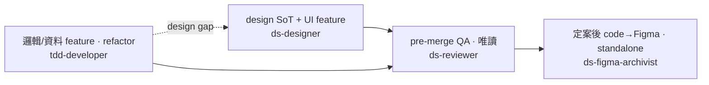
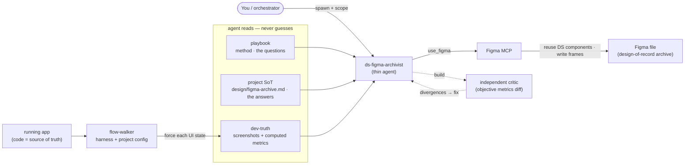

# ds-agents — Claude Code 設計系統 agent

> 給 solo founder / 小團隊用的 Claude Code agent。在 brand 跟 design 之間建立明確分工，讓 AI 寫 UI code 時自動 anchor 在你的品牌規則上；surface 定案後還能把 code 存回 Figma 建檔。
>
> English version → [README.en.md](./README.en.md)

---

## 為什麼有這個 repo

solo founder 跑多個 side project 時，最痛的點是：
- brand 文件散落（vault / Notion / repo root / Figma 註解都有）
- design system 跟 brand 反覆 drift（spec 改了 code 沒同步、或反過來）
- 每個新 project 都要重新發明結構

這個 repo 把跑過一次的真實流程 distill 出來：固定 folder 結構 + agent contract + 通用 design 知識（`references/`）。從第二個 project 開始就可以直接套用。

**這不是設計系統理論**。是「實際跑過後留下的接地氣 SOP」。

---

## 概念

```
<你的產品 repo>/
├── brand/              ← 策略 / 品牌身份（ds-designer read-only）
│   ├── brandbook.md       完整 brand book（Strategy + Voice + Personality）
│   ├── pillars.md         4 axioms / archetype / verbs / manifesto 精煉版
│   ├── evolution.md       brand 變更紀錄（含 active / pending / rejected / queue）
│   ├── audit.md           自審報告（frozen by date，optional）
│   └── chisel-skill.md    brand chisel 方法論（meta，optional）
├── design/             ← 程式碼綁定的實作層
│   ├── guideline.md       ★ Foundations / Components / Patterns / Principles 4 大段
│   ├── tokens.md          ★ CSS variable + Tailwind name spec
│   ├── figma-archive.md   （用 ds-figma-archivist 時）該產品的 Figma 存檔答案
│   └── README.md
└── src/...
```

**兩個資料夾，職責分清楚**：

- **brand/** = 策略身份。季 / 半年才更新一次。agent **不會寫**。跨 project 可整包搬走。
- **design/** = 程式碼綁定的實作層。每個 PR 都可能動。ds-designer 寫，ds-reviewer 讀。

### 不在這個 repo 提供的（你自己定義）

- **Brand 內容** — brand chisel 是另一個工具的事（你可以用 Brand Book Skill 或自己 chisel）。本 repo 不 vendoring brand 內容
- **Develop guideline**（PR 流程 / commit message / branch 策略 / review checklist）— 屬於團隊治理，每個團隊不一樣。住在你的 `<repo>/CLAUDE.md` 或 `CONTRIBUTING.md`

---

## 🗺️ 何時用哪隻（一眼看）



- **ds-designer** — 建 / 維護 design SoT（`design/guideline.md`）**＋ UI / component feature**（M2 enforce、套既有 token/component）。從 0 起手用 M1 bootstrap（seed 通用知識，見下 Schema 段）。
- **tdd-developer** — **邏輯 / 資料 feature ＋ 純 refactor**（不動 UI、input→output、TDD）；遇 design gap 自動回頭觸發 ds-designer。
- **ds-reviewer** — pre-merge 唯讀 QA，對 guideline 出 P0/P1/P2。
- **ds-figma-archivist** — 一個 surface **定案後**把 code 建回 Figma 存檔；standalone、不進上面 pipeline（機制見下）。

## 📋 skills + 起手（圖沒涵蓋的）

> agent 之間「何時用哪隻」看上面的圖。此表只列圖畫不出來的起手 / skill。

| 情境 | 用什麼 | 為什麼 |
|---|---|---|
| 剛 chisel 完 brand，要建 design system 起手 | **`ds-designer` M1 bootstrap** | 訪談式建 guideline、seed 通用知識、你只填產品專屬 `<TODO>`（細節見 Schema 段） |
| 用 Claude Design 雲端做視覺探索，要交給 Claude Code dev | **`skills/_skill_design-handoff.md`**（餵給 Claude Design） | Claude Design 跑 6-phase workflow 產 handoff 包，Claude Code 接（跨工具，agent 取代不了） |

---

## 安裝

```bash
git clone https://github.com/YinNingWang/ds-agents.git ~/sandbox/ds-agents
cd ~/sandbox/ds-agents
./install.sh
```

`install.sh` 裝兩樣：
- `agents/*.md` → `~/.claude/agents/`（Claude Code 的 user-level agent 目錄）
- `references/*.md` → `~/.claude/references/`（agent 執行時讀的 method playbook + design universals）

`tools/` 跟 `skills/` **不會自動安裝**：
- `tools/`（flow-walker capture harness）從 repo 跑（`cd tools/flow-walker && npm install`）
- `skills/` 是 prompt template，要用時複製內容貼進 AI session

> **為什麼 `~/.claude/` 只有 agents + references、沒 tools（刻意，不是漏裝）**：agent **讀**的東西（playbook / universals）才裝到固定路徑，讓它從任何 cwd 讀得到；**跑**的工具（harness）留 repo。

---

## Schema 合約（重要 — agent 認的是這個）

`design/guideline.md` **必須**用以下 schema，ds-designer / ds-reviewer 才能 work：

```
# <產品名> Design Guideline

## How to use this
## Foundations
  （token 架構、theme×palette、typography、spacing、motion）
## Components
  （Button、Section、Icon、Currency、Sheet…）
## Patterns
  （visual constraints R1-Rn、state pattern、互動 pattern）
## Principles
  （brand axioms pointer、voice pointer、anti-patterns、governance）
## PR Design Review Checklist
## References
## Decisions log     ← append-only，ds-designer Drift Protocol 寫入
## Open items        ← 活躍 backlog，ds-reviewer findings 寫入
```

`design/tokens.md` **必須**包含 CSS variable 定義 + Tailwind extend snippet — 它是 `globals.css` 的 source of truth。

→ 不用手抄：**ds-designer M1 bootstrap 會照這個 schema 建**，並從 `references/ds-design-universals.md` seed 通用知識（component 原則 / state patterns / anti-patterns / governance / PR checklist），你只補產品專屬 `<TODO>`。

---

## 🧭 ds-figma-archivist 運作機制



四個零件、各就各位：

- **agent（薄）** (`agents/`) — 只 orchestrate；讀 playbook + 專案 SoT + dev-truth，驅動 Figma MCP。不含深度。
- **playbook** (`references/`) — 通用方法 / 問句（第一性原則 + Figma MCP call-shape appendix）。跨專案。
- **專案 SoT** (`<repo>/design/figma-archive.md`) — 該產品的答案（file key / components / frame sizes / 決策）。跨 session。
- **flow-walker** (`tools/`) — 通用 harness + 專案 config，驅動 app 產 dev-truth（截圖 + computed metrics，供「量而非估」）。

> playbook 載問句、專案 SoT 載答案、flow-walker 供 dev 真相、agent 組進 Figma、獨立 critic 客觀驗。

---

## ⚠ 一個歷史限制（已解除）

> **[更新 2026-07] 已大致解除** — Claude Code 現已支援 user-defined agent 經 `Agent` tool 的 `subagent_type` 程式化 spawn（本 repo agent 實測可直接叫）。以下留作歷史 / 降級參考。

早期 Claude Code 還不支援「主 session 自動把自定義 agent 叫起來跑」，本 repo agent 曾需繞道。降級 workaround（現多半用不到）：

1. **讓主 session 內化執行** — 把 agent 內容貼進 session，請它「照這份 spec 做事」。對 ds-reviewer 這種純讀檔產報告的最順。
2. **包一層 skill 叫** — agent spec 包進 `~/.claude/skills/<name>/SKILL.md`，用 skill 觸發（semantics 跟真 subagent 不同）。
3. **另開 session 跑** — 為 context 隔離，開新 session 貼 spec + 任務互動執行。

---

## 版本管理

- **patch** (`v0.1.x`) — 字句修
- **minor** (`v0.x.0`) — 新 agent / skill / reference / additive 改動
- **major** (`v1.0.0`) — schema 破壞（例如 guideline.md 章節名要求變動）

---

## Roadmap

- [ ] Cross-project 測試 harness — 用固定 snapshot 範例 codebase 跑 ds-reviewer
- [ ] Brand Book Skill 整合：chisel 完直接輸出進 `<repo>/brand/`
- [ ] N=2 dogfood 在不同 product（含 flow-walker config）→ 萃出 v2 patterns + 通用 config 範式

---

## 貢獻

歡迎的 PR：
- 新增符合 brand/+design/ 合約的 agent
- `references/ds-design-universals.md` 通用 design 知識補充
- 不同 stack 的 flow-walker config 範例

---

## License

MIT — 見 [`LICENSE`](./LICENSE)。

---

*Made for Taiwan solo / small-team product folks who run Claude Code. 給用 Claude Code 的台灣個人 / 小團隊 product 開發者。*
