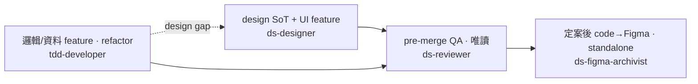

# ds-agents — Claude Code 設計系統 agent

> 給 solo founder / 小團隊用的 Claude Code agent。在 brand 跟 design 之間建立明確分工，讓 AI 寫 UI code 時自動 anchor 在你的品牌規則上。
>
> English version → [README.en.md](./README.en.md)

---

## 🚀 快速開始

### 1. `agents/` — 四隻 agent（裝起來或載下來呼叫）

- **`ds-designer.md`** → design guideline 建置設計師，design system 從 0 起手或維護時用
- **`ds-reviewer.md`** → 都建完了，叫這隻 review 有沒有哪裡缺漏
- **`tdd-developer.md`** → 工程師 agent，TDD 寫法 + 自動載入 design context。適合有明確 input→output 的 feature（API / schema / DB / 邏輯），遇到設計 gap 會自動 PAUSE 觸發 ds-designer。
- **`ds-figma-archivist.md`** → 把**定案**的 code 畫面重建回 Figma 存檔（Figma 退場前留 design-of-record），薄殼 orchestrate 既有 Figma MCP + 套現有 DS library。**standalone，不進 pipeline**、只在定案後手動叫。

### 2. `skills/` — 兩個 prompt 餵給 AI 跑

- **`_skill_design-handoff.md`** → 餵給 **Claude Design**，他會幫忙產比較完整的 PRD 包：先問你 codebase 在哪，讀完 codebase 的開發框架與命名方式，再產出更適合這個 codebase 的 `handoff.zip`，丟給 Claude Code 讀過就可以開發/套用設計
- **`stage-0-visual-audit.md`** → 餵給 **Claude Code**，盤點既有 codebase 跟 brand 之間的視覺 drift。**只有「既有 codebase + brand 已存在」想知道差距時才用**

### 3. `starter/` — design 系統的初始 scaffold

從 0 開始建 design system 時，**整包 `starter/` 載下來放進你的 repo**（rename 成你的 product），之後 ds-designer 直接修改擴增使用。內含通用 anti-pattern + governance scaffold，省掉重複發明。

---

## 🗺️ 何時用哪隻（一眼看）



- **ds-designer** — 建 / 維護 design SoT（`design/guideline.md`）**＋ UI / component feature**（M2 enforce、套既有 token/component）。
- **tdd-developer** — **邏輯 / 資料 feature ＋ 純 refactor**（不動 UI、input→output、TDD）；遇 design gap 自動回頭觸發 ds-designer。
- **ds-reviewer** — pre-merge 唯讀 QA，對 guideline 出 P0/P1/P2。
- **ds-figma-archivist** — 一個 surface **定案後**把 code 建回 Figma 存檔；standalone、不進上面 pipeline。

## 📋 skills / starter / 起手選擇（圖沒涵蓋的）

> agent 之間「何時用哪隻」看上面的圖。此表只列圖畫不出來的 skills / starter / 起手選擇。

| 情境 | 用什麼 | 為什麼 |
|---|---|---|
| 剛 chisel 完 brand，要建 design system 起手 | **`starter/` (copy 進專案)** 或 **`ds-designer` M1 bootstrap** | starter = 快路（5 分鐘 copy + edit）；M1 = 訪談式（30-60 分鐘，更客製） |
| 既有 codebase + brand 已存在，想盤點視覺 drift | **`skills/stage-0-visual-audit.md`**（貼進 Claude Code session） | 一次性 audit，產出 drift report 後再進 ds-designer |
| 用 Claude Design 雲端做視覺探索，要交給 Claude Code dev | **`skills/_skill_design-handoff.md`**（餵給 Claude Design） | Claude Design 跑 6-phase workflow 產 handoff 包，Claude Code 接 |

---

## 🧭 ds-figma-archivist 運作機制


四個零件、各就各位：

- **agent（薄）** (`agents/`) — 只 orchestrate；讀 playbook + 專案 SoT + dev-truth，驅動 Figma MCP。不含深度。
- **playbook** (`references/`) — 通用方法 / 問句（第一性原則 + Figma MCP call-shape appendix）。跨專案。
- **專案 SoT** (`<repo>/design/figma-archive.md`) — 該產品的答案（file key / components / frame sizes / 決策）。跨 session。
- **flow-walker** (`tools/`) — 通用 harness + 專案 config，驅動 app 產 dev-truth（截圖 + computed metrics，供「量而非估」）。

> playbook 載問句、專案 SoT 載答案、flow-walker 供 dev 真相、agent 組進 Figma、獨立 critic 客觀驗。

**安裝為什麼 `~/.claude/` 看不到全部（刻意，不是漏裝）**：`install.sh` 裝 `agents/` → `~/.claude/agents/`、`references/` → `~/.claude/references/`（agent 執行時要能從**任何 cwd** 讀到 playbook，故裝固定路徑）；**`tools/` 不裝** —— harness 是你 / orchestrator 從 repo 跑（`npm install` 一次）產 dev-truth，**agent 本身不讀它**。分工一句話：agent **讀**的東西才裝、**跑**的工具留 repo。

---

## 為什麼有這個 repo

solo founder 跑多個 side project 時，最痛的點是：
- brand 文件散落（vault / Notion / repo root / Figma 註解都有）
- design system 跟 brand 反覆 drift（spec 改了 code 沒同步、或反過來）
- 每個新 project 都要重新發明結構

這個 repo 把跑過一次的真實流程 distill 出來：固定 folder 結構 + agent contract + starter scaffold + 通用 anti-pattern。從第二個 project 開始就可以直接套用。

**這不是設計系統理論**。是「實際跑過後留下的接地氣 SOP」。

---

## 概念

```
<你的產品 repo>/
├── brand/              ← 策略 / 品牌身份（ds-designer read-only）
│   ├── brandbook.md       完整 brand book（Strategy + Voice + Personality）
│   ├── pillars.md         4 axioms / archetype / verbs / manifesto 精煉版
│   ├── evolution.md       brand 變更紀錄（含 active / pending / rejected / queue）
│   ├── audit.md           自審報告（frozen by date，optional）
│   └── chisel-skill.md    brand chisel 方法論（meta，optional）
├── design/             ← 程式碼綁定的實作層
│   ├── guideline.md       ★ Foundations / Components / Patterns / Principles 4 大段
│   ├── tokens.md          ★ CSS variable + Tailwind name spec
│   ├── README.md
│   └── stage-0/           （optional）一次性 codebase audit 歷史
└── src/...
```

**兩個資料夾，職責分清楚**：

- **brand/** = 策略身份。季 / 半年才更新一次。agent **不會寫**。跨 project 可整包搬走。
- **design/** = 程式碼綁定的實作層。每個 PR 都可能動。ds-designer 寫，ds-reviewer 讀。

### 不在這個 repo 提供的（你自己定義）

- **Brand 內容** — brand chisel 是另一個工具的事（你可以用 [Brand Book Skill](https://github.com/YinNingWang) 或自己 chisel）。本 repo 不 vendoring brand 內容
- **Develop guideline**（PR 流程 / commit message / branch 策略 / review checklist）— 屬於團隊治理，每個團隊不一樣。住在你的 `<repo>/CLAUDE.md` 或 `CONTRIBUTING.md`

---

## 安裝

```bash
git clone https://github.com/YinNingWang/ds-agents.git ~/sandbox/ds-agents
cd ~/sandbox/ds-agents
./install.sh
```

`install.sh` 會裝兩樣（見上「運作機制」的分工說明）：
- `agents/*.md` → `~/.claude/agents/`（Claude Code 的 user-level agent 目錄）
- `references/*.md` → `~/.claude/references/`（agent 執行時讀的 method playbook，需固定路徑才能從任何 cwd 讀到）

`tools/`、`skills/`、`starter/` **不會自動安裝**：
- `tools/`（flow-walker capture harness）從 repo 跑（`cd tools/flow-walker && npm install`）——agent 不讀它，是產 dev-truth 的工具
- `skills/` 是 prompt template，要用時複製內容貼進 AI session
- `starter/` 是 scaffold，要用時整包複製進你的 repo

---

## Schema 合約（重要 — agent 認的是這個）

`design/guideline.md` **必須**用以下 schema，ds-designer / ds-reviewer 才能 work：

```
# <產品名> Design Guideline

## How to use this
## Foundations
  （token 架構、theme×palette、typography、spacing、motion）
## Components
  （Button、Section、Icon、Currency、Sheet…）
## Patterns
  （visual constraints R1-Rn、state pattern、互動 pattern）
## Principles
  （brand axioms pointer、voice pointer、anti-patterns、governance）
## PR Design Review Checklist
## References
## Decisions log     ← append-only，ds-designer Drift Protocol 寫入
## Open items        ← 活躍 backlog，ds-reviewer findings 寫入
```

`design/tokens.md` **必須**包含 CSS variable 定義 + Tailwind extend snippet — 它是 `globals.css` 的 source of truth。

→ `starter/design/guideline.md` 已內建這個 schema + 通用 anti-pattern，照抄即可。

---

## ⚠ 一個現在還不方便的地方

> **[更新 2026-07] 此限制已大致解除** — Claude Code 現已支援 user-defined agent 經 `Agent` tool 的 `subagent_type` 程式化 spawn（本 repo agent 實測可直接叫）。以下 workaround 留作歷史 / 降級參考。

**白話版**：理論上 Claude Code 應該可以「主 session 自動把你自定義的 agent 叫起來跑」，早期還沒支援。所以本 repo 的四隻 agent 曾**沒辦法用 `Agent` tool 一鍵 spawn**，需要繞一下。

具體狀況（歷史）：Claude Code 內建 6 隻 agent（claude / Explore / Plan 等）能被程式呼叫，但 `~/.claude/agents/` 下你自己放的 agent（包含本 repo 這四隻）當時還不能這樣自動 spawn。

**目前的 3 個解法**（沒到不能用，只是手動一點）：

1. **最簡單 · 讓主 session 自己內化執行**
   開 Claude Code session，把 agent 的內容貼進去，請主 session「照這份 spec 做事」。
   對 ds-reviewer 這種純讀檔產報告的 agent **最順**，因為它本來就不需要 context 隔離。

2. **包一層 skill 來叫**
   把 agent spec 包進 `~/.claude/skills/<name>/SKILL.md`，之後用 skill 觸發。
   trade-off：執行 semantics 跟真的 subagent 不一樣（skill 不是隔離 process）。

3. **另開一個 session 跑**
   為了 context 隔離，特地開新的 Claude Code session，把 agent spec + 想做的事貼進去，互動執行。

**未來變方便了會怎樣？**
Claude Code 之後支援 user-defined agent 程式化 spawn 後，現有 agent spec **不用改**就能無痛切過去。所以現在這個不方便不會造成 future migration cost。

---

## 版本管理

- **patch** (`v0.1.x`) — 字句修
- **minor** (`v0.x.0`) — 新 agent / skill / starter / additive 改動
- **major** (`v1.0.0`) — schema 破壞（例如 guideline.md 章節名要求變動）

目前 `v0.2.0` — sealed from 一次 dogfood reference run。

---

## Roadmap

- [ ] 每隻 agent 各包一個 Skill wrapper（程式化 spawn workaround）
- [ ] Cross-project 測試 harness — 用固定 snapshot 範例 codebase 跑 ds-reviewer
- [ ] 更多 starter scaffold 變體（不同 stack：SvelteKit + Tailwind、Astro + UnoCSS 等）
- [ ] Brand Book Skill 整合：chisel 完直接輸出進 `<repo>/brand/`
- [ ] N=2 dogfood run 在不同 product → 萃出 v2 patterns

---

## 貢獻

歡迎的 PR：
- 不同 stack 的 starter scaffold 變體
- 新增符合 brand/+design/ 合約的 agent
- starter 通用 anti-pattern / governance 補充

---

## License

MIT — 見 [`LICENSE`](./LICENSE)。

---

*Made for Taiwan solo / small-team product folks who run Claude Code. 給用 Claude Code 的台灣個人 / 小團隊 product 開發者。*
